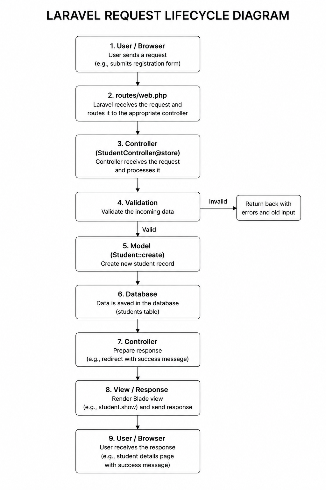
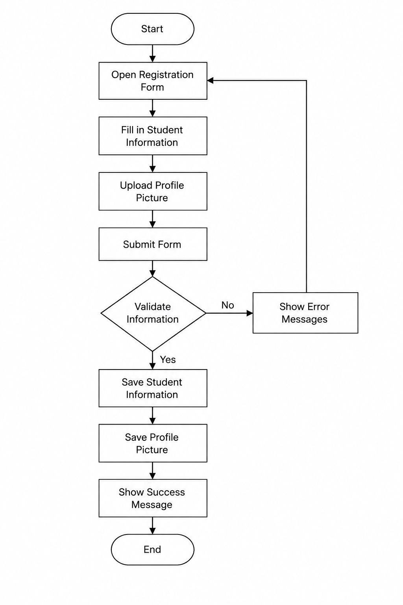
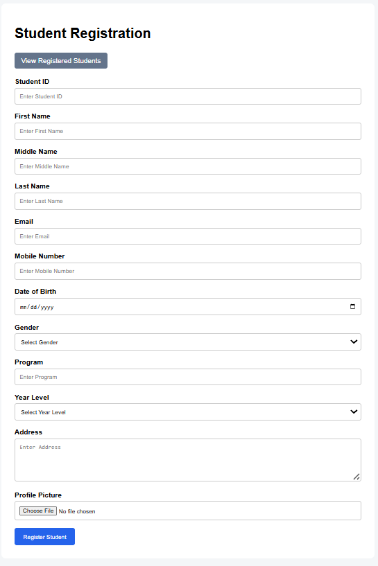
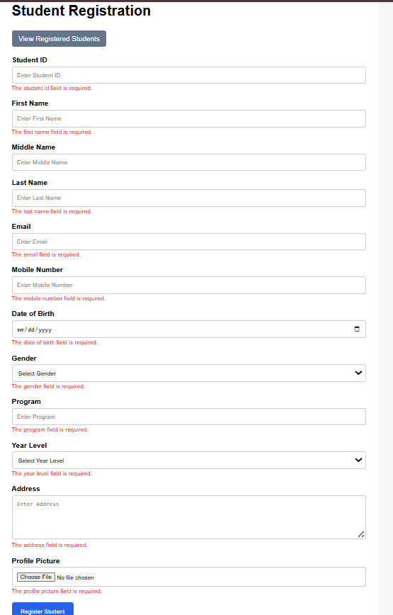
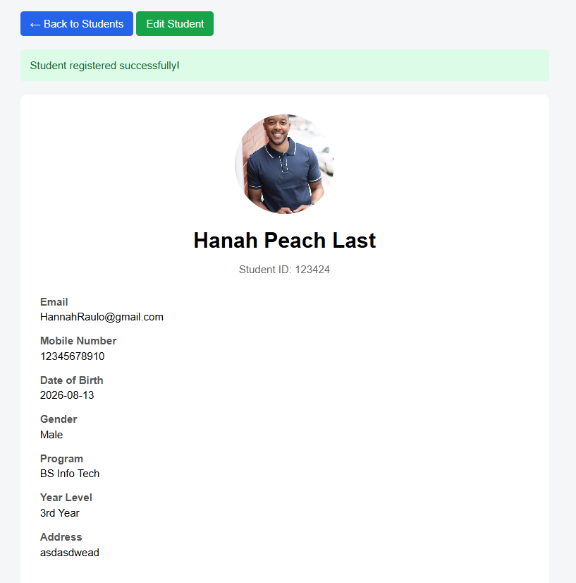
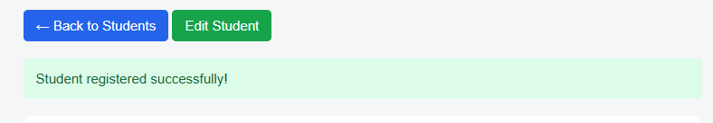
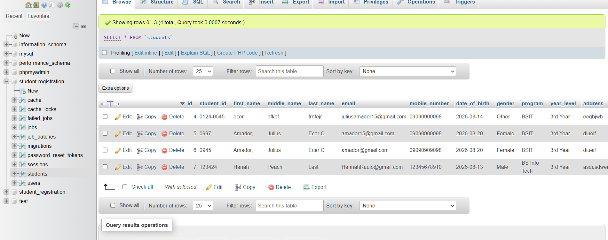
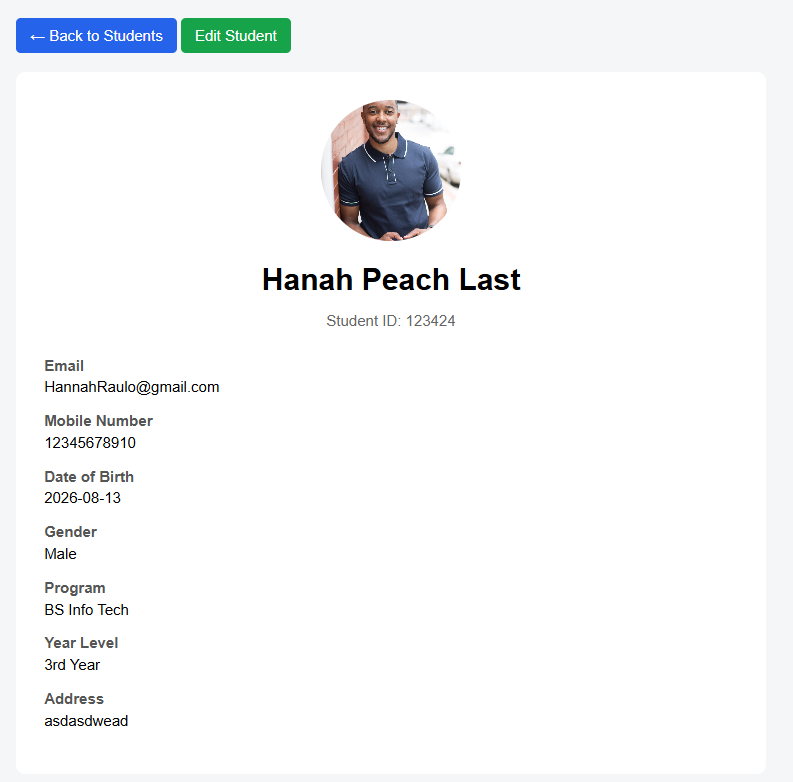
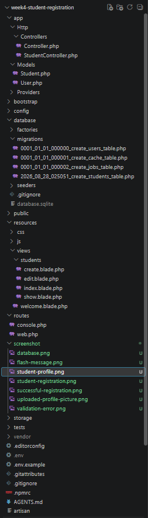
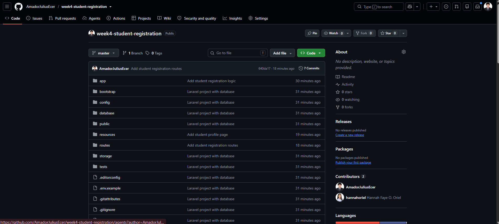

# Student Registration System

A Laravel-based Student Registration System developed for managing student information, registration, profile pictures, validation, and student records.

---

## 1. Project Title

# Student Registration System

The **Student Registration System** is a Laravel-based web application designed to register, manage, and display student information through a structured and user-friendly interface.

---

## 2. Introduction

The **Student Registration System** is a web-based application developed using the Laravel framework. It allows users to register students by entering their personal, contact, and academic information. The system also supports profile picture uploads, student profile viewing, editing, and displaying registered student records.

The main purpose of the system is to provide an organized way of collecting and managing student information. Instead of manually recording student information, users can enter the required details through an online registration form. The submitted information is then validated before being stored in the MySQL database.

Data validation is an important part of the system because it prevents incorrect, incomplete, or invalid information from being stored in the database. Laravel's built-in validation features allow the application to check submitted information before processing and saving it.

Registration systems are commonly used in enterprise applications because organizations need an organized and reliable way to collect, validate, store, and manage information. Schools, companies, hospitals, government offices, and other organizations can use registration systems to improve data accuracy, reduce manual work, and make information easier to manage.

---

## 3. Objectives

The objectives accomplished during this activity are:

- To understand the Laravel MVC architecture.
- To create a student registration form using Laravel Blade.
- To implement student registration and record management.
- To apply server-side validation.
- To implement required field validation.
- To implement unique field constraints.
- To validate email inputs.
- To validate numeric inputs.
- To validate date inputs.
- To restrict program selections using validation rules.
- To implement image upload functionality.
- To restrict accepted image formats.
- To apply file size restrictions.
- To store uploaded images using Laravel Storage.
- To connect Laravel to a MySQL database.
- To create and use database migrations.
- To create and use an Eloquent model.
- To display validation errors.
- To display success flash messages.
- To display registered student profiles.
- To implement student information editing.
- To understand the Laravel Request Lifecycle.
- To create a database Entity Relationship Diagram.
- To create a registration flowchart.
- To organize and document a Laravel project using Git and GitHub.

---

# 4. Laravel Request Lifecycle

The Laravel Request Lifecycle describes how a request travels through different parts of the Laravel application.

For the Student Registration System, the registration process generally follows:

**Browser → Route → Controller → Validation → Model → Database → Response**

### Request Process

1. **Browser**
   - The user opens the Student Registration Page.
   - The user fills out the registration form.
   - The user submits the completed form.

2. **Route**
   - Laravel receives the submitted request through the appropriate route.
   - The route directs the request to the `StudentController`.

3. **Controller**
   - The `StudentController` receives the request.
   - The appropriate controller method processes the submitted student information.

4. **Validation**
   - Laravel checks the submitted information before it is stored.
   - Required fields, unique fields, email format, numeric values, date values, program choices, and profile picture requirements are validated.

5. **Model**
   - After successful validation, the `Student` model is used to create or update the student record.

6. **Database**
   - The validated student information is stored in the `students` table.
   - The profile picture path is also stored in the database when a picture is uploaded.

7. **Response**
   - After successful registration, Laravel redirects the user to the appropriate student page.
   - A success flash message can also be displayed to confirm that the operation was successful.

### Laravel Request Lifecycle Diagram



---

# 5. Validation Rules

The Student Registration System uses Laravel server-side validation to make sure that submitted information follows the requirements of the application.

| Validation Rule | Purpose |
|---|---|
| `required` | Makes sure important fields are not empty. |
| `unique` | Prevents duplicate Student IDs and email addresses. |
| `email` | Ensures that the email follows a valid email format. |
| `numeric` | Ensures that the mobile number contains numeric values. |
| `image` | Ensures that the uploaded file is a valid image. |
| `mimes:jpg,jpeg,png` | Restricts profile pictures to accepted image formats. |
| `max:2048` | Limits the uploaded image size to a maximum of 2 MB. |
| `date` | Ensures that the date of birth is a valid date. |
| `in:BSIT,BSCS` | Restricts the program to the available programs. |

### Required Fields

The `required` validation rule makes sure that important student information is not left blank.

Required validation is important because incomplete student records may cause problems when the information is stored and retrieved later.

### Unique Constraints

The `unique` validation rule prevents duplicate values from being stored in fields that should contain unique information.

The Student ID and email address are required to be unique.

This prevents multiple student records from using the same identifying information.

### Email Validation

The `email` rule checks whether the submitted email follows a valid email format.

This helps prevent incorrect email addresses from being stored in the database.

### Numeric Validation

The `numeric` rule checks whether the submitted mobile number contains numeric values.

This helps prevent invalid characters or letters from being entered into the mobile number field.

### Image Validation

The `image` rule checks whether the uploaded file is an image.

The system also restricts profile pictures to JPG, JPEG, and PNG formats.

This helps prevent unsupported file types from being uploaded.

### File Size Restrictions

The `max:2048` rule limits the profile picture to a maximum size of **2 MB**.

This helps reduce unnecessary storage usage and prevents users from uploading excessively large files.

### Date Validation

The `date` rule checks whether the submitted date of birth is a valid date.

This helps ensure that the database contains properly formatted date information.

### Program Validation

The `in:BSIT,BSCS` rule restricts the program field to the available program choices.

This prevents users from submitting unsupported program values.

---

# 6. Database Design

The Student Registration System uses a MySQL database to store student information.

The main table used by the application is students.

---

# 7. Registration Flowchart

The registration process begins when the user opens the registration page and ends when the student's profile is displayed after successful registration.

### Registration Flowchart Image




# 8. Screenshots

The following screenshots demonstrate the different parts and features of the Student Registration System.

## Registration Form

The registration form allows the user to enter the student's personal, contact, academic, and profile picture information.



---

## Validation Errors

Laravel displays validation errors when the submitted information does not follow the required validation rules.



---

## Successful Registration

After successfully registering a student, the system redirects the user to the student's profile page.



---

## Flash Success Message

A success flash message confirms that the student was successfully registered.



---

## Uploaded Profile Picture

The system allows users to upload a student's profile picture using JPG, JPEG, or PNG files with a maximum size of 2 MB.


---

## Database Table

The registered student information is stored in the MySQL `students` table.



---

## Student Profile Page

The Student Profile Page displays the information of the selected student, including the student's personal, contact, academic, and profile picture information.



---

## VS Code Project Structure

The project structure shows the Laravel application folders, Blade views, controllers, models, routes, documentation, and other project files.



---
## GitHub Repository

The completed Laravel project was uploaded and organized in a GitHub repository for version control and project documentation.



# 9. Problems Encountered

Several challenges were encountered during the development of the Student Registration System.

### 1. Validation Errors Not Displaying Properly

One of the challenges encountered was making sure that validation errors were properly displayed when the user submitted incomplete or invalid information. The validation rules had to be correctly configured in the controller, and the error messages needed to be properly displayed in the Blade view.

### 2. Image Upload Path

Another challenge was storing and displaying the uploaded profile picture. The uploaded image needed to be saved in the correct storage directory, while the correct file path needed to be stored in the database.

### 3. Storage Link

Another problem encountered was accessing uploaded profile pictures from the browser. Laravel stores public files inside the storage directory, so the proper storage link needed to be created to make the uploaded images accessible.

### 4. Database Connection

A database connection issue was also encountered during development. Laravel needed to be properly configured to connect to the MySQL database through the `.env` file. Incorrect database settings could prevent the application from creating tables or saving student records.

### 5. Flash Success Message

Another challenge was displaying the success message after successfully registering a student. The message needed to be properly passed through the session during the redirect so that it could be displayed on the next page.

### 6. Form Data and Database Records

Another challenge was ensuring that the information submitted through the registration form matched the fields in the database. The controller, model, migration, and Blade form needed to use consistent field names to prevent missing or incorrect data.

# 10. Solutions

### Solution 1: Laravel Validation

Laravel's `$request->validate()` method was used inside the controller to validate submitted information before saving it.

### Solution 2: Profile Picture Storage

The uploaded image was stored using Laravel's public storage disk:

```php
$data['profile_picture'] = $request
    ->file('profile_picture')
    ->store('profile_pictures', 'public');
```

The resulting file path is then saved in the `profile_picture` field.

### Solution 3: Storage Link

Laravel's storage link allows files stored in `storage/app/public` to be accessed through the application's public directory.

The following command was used:

```bash
php artisan storage:link
```

### Solution 4: Database Connection

The `.env` file was configured to connect Laravel to the MySQL database. After configuring the database connection, the application was able to save student records successfully.

### Solution 5: Flash Success Message

A success message can be passed during the redirect using Laravel's session flash data:

```php
return redirect()
    ->route('students.show', $student->id)
    ->with('success', 'Student registered successfully!');
```

The Blade page can then display the message using:

```php
@if(session('success'))
    <div>
        {{ session('success') }}
    </div>
@endif
```

---

# 11. Reflection

Developing the Student Registration System helped me understand the importance of validation, user input handling, server-side processing, database management, and file security in web applications. Before working on this project, I thought that creating a registration system mainly involved creating a form and saving the submitted information into a database. However, while developing the system, I learned that several processes are necessary to make sure that the information is correct, organized, and safe before it is stored.

One of the most important lessons I learned is the importance of data validation. Validation helps make sure that the information submitted by users is complete and follows the requirements of the system. For example, required field validation prevents important information from being left blank. Unique validation prevents duplicate Student IDs and email addresses. Email validation checks whether the email follows the correct format, while numeric validation helps make sure that the mobile number contains appropriate values. These rules help maintain the accuracy and consistency of the database.

I also learned that user input should never be automatically trusted. Users can accidentally enter incorrect information or intentionally submit unexpected values. Because of this, the application needs to check submitted information before processing it. Laravel provides built-in validation rules that make this process easier. By defining validation rules in the controller, the application can check the submitted data before allowing it to be saved in the database.

Another important lesson from this activity is the difference between client-side and server-side validation. Client-side validation is useful because it can provide immediate feedback to the user. For example, HTML and JavaScript validation can tell the user that a required field is empty before the form is submitted. However, client-side validation alone is not enough because it can be bypassed or disabled. A user may also send a request directly to the server without using the normal registration form.

Server-side validation is more reliable because the submitted information is checked by the server before it is processed or stored. Even if client-side validation is bypassed, Laravel can still validate the request. This makes server-side validation an important security and data integrity feature in web applications. Using both client-side and server-side validation can provide a better user experience while still protecting the application.

File security was another important lesson I learned from this project. Since the system allows users to upload profile pictures, the application must check the uploaded files before storing them. Image validation makes sure that the uploaded file is an acceptable image, while the `mimes` rule limits the file to JPG, JPEG, and PNG formats. The `max:2048` rule also limits the file size to 2 MB. These restrictions help prevent unsupported or unnecessarily large files from being uploaded and stored.

The project also helped me understand how registration systems are used in real-world enterprise applications. Schools can use registration systems to manage student records and enrollment information. Companies can use similar systems for employee registration, customer registration, and membership management. Hospitals, government offices, and other organizations can also use registration systems to collect and organize important information. These systems reduce manual work, improve data accuracy, and make records easier to access and manage.

I also gained a better understanding of how different parts of Laravel work together. The browser sends a request, the route directs the request to the controller, the controller validates the information, the model communicates with the database, and Laravel returns a response to the user. Understanding this request lifecycle helped me understand how a Laravel application processes information.

Overall, this activity improved my understanding of Laravel, database management, validation, file uploads, and web application development. I learned that creating a registration system is not only about making a form work. The application must also properly validate user input, protect uploaded files, maintain database accuracy, and provide clear feedback to users. The knowledge I gained from this activity will help me create more reliable, organized, and secure web applications in the future.

# 12. References

Laravel. (n.d.). *Laravel documentation*.  
https://laravel.com/docs

MDN Web Docs. (n.d.). *MDN Web Docs*. Mozilla.  
https://developer.mozilla.org/

Oracle. (n.d.). *MySQL 8.4 reference manual*.  
https://dev.mysql.com/doc/refman/8.4/en/

PHP Documentation Group. (n.d.). *PHP manual*.  
https://www.php.net/docs.php

Tailwind Labs. (n.d.). *Tailwind CSS documentation*.  
https://tailwindcss.com/docs
